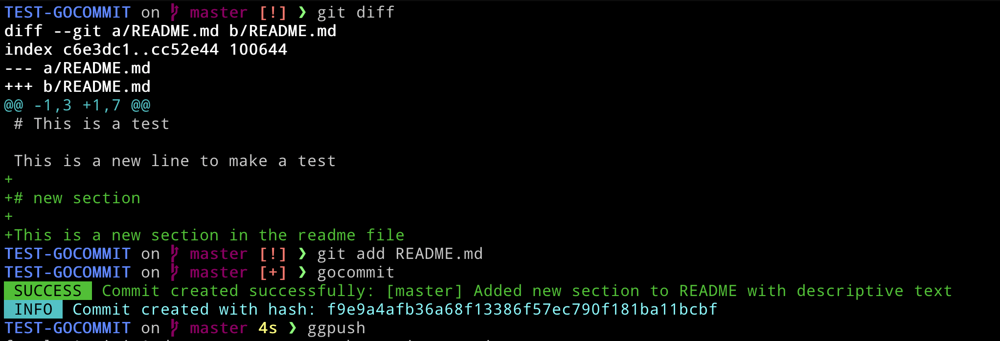

# GoCommit

This creates commits with automatically generated messages from the `git diff --cached` using ollama




## Installation

### ⚠️ Requirement
```
ollama pull gemma3
```
### Precompiled Binaries

You can download the precompiled binaries from the [releases](https://github.com/vicendominguez/gocommit/releases) page on GitHub.

#### Linux (amd64)

1. Download the Linux binary from the releases page.
2. Make the binary executable:

   ```bash
   chmod +x gocommit-vX.X.X-linux-amd64
   sudo mv gocommit-vX.X.X-linux-amd64 /usr/local/bin/gocommit
   ```

#### macOS

**Using Homebrew (Recommended):**

```bash
brew tap vicendominguez/tap
brew install gocommit
```

**Manual Installation:**

1. Download the macOS binary from the [releases](https://github.com/vicendominguez/gocommit/releases) page.
2. Make the binary executable:

   ```bash
   chmod +x gocommit-vX.X.X-darwin-arm64
   sudo mv gocommit-vX.X.X-darwin-arm64 /usr/local/bin/gocommit
   ```

#### Debian Package (amd64)

1. Download the .deb package from the [releases](https://github.com/vicendominguez/gocommit/releases) page.

2. Install the package using dpkg:

```bash
sudo dpkg -i gocommit_X.X.X_amd64.deb
```

## Usage

```
Usage: gocommit [options]
  -c	Use conventional commits format
  -dry-run
    	Show a message example
  -help
    	Show available flags
  -model string
    	Specify the Ollama model to use (default "gemma3")
  -no-prefix
    	Disable the prefix in the commit message. [branch] by default
  -prefix string
    	Define a custom prefix for the commit message
  -version
    	Show the version of the application
```


1. **Stage Your Changes**:
   - Use `git add` to stage your changes:
     ```bash
     git add -A
     ```

2. **Run GoCommit**:
   - Invoke the tool to automatically generate and create a commit:
     ```bash
     gocommit
     ```
   - For conventional commits format ([spec](https://www.conventionalcommits.org/en/v1.0.0/)):
     ```bash
     gocommit -c
     ```
3. **puah Your Changes**:
   -  Use  `git push` to push your changes:
     ```bash
     git push
     ```

## Rules

- Ensure you have a branch checked out before running `gocommit`. If you don't have a branch, create one using:
  ```bash
  git branch <branch-name>
  git checkout <branch-name>

- Reminder: Dry-run mode is not deterministic. The message is coming from Ollama with LLM.

## Work in progress

BUGS to fix:

- [ ] The fucking `git diff --cached` is  not implemented using the `go-git` library. Currently is a shitty exec.

## Building from Source

  ```bash
  git clone https://github.com/your-username/your-repo.git
  cd your-repo
  go build -o gocommit ./cmd/gocommit
  sudo mv gocommit /usr/local/bin/ 
  ```
